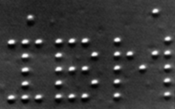
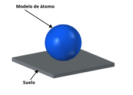
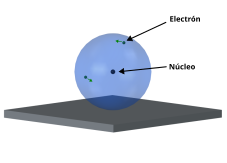
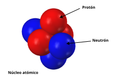
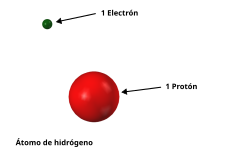
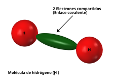
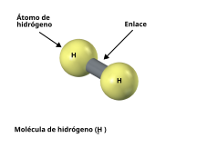

# Punto de partida: Los átomos

Toda la **materia** que está a nuestro alrededor está formada por **átomos**. Este conocimiento lo hemos obtenido gracias a los **científicos**, cuya misión es desvelar los secretos de **la naturaleza**, y obtener sus **leyes fundamentales**

En nuestros **modelos simplificados**, vamos a representar cada átomo como una **esfera** que ocupa un volumen. Esto **NO ES LA REALIDAD**. Los átomos **NO SON ESFERAS**. Sin embargo es una **representación simplificada** que nos sirve para entender las ideas principales de los chips

Este modelo, aunque simplificado, es lo suficientemente preciso como para entender la disposición de los átomos para formar materiales. Utilizando un [microscopio de efecto tunel](https://es.wikipedia.org/wiki/Microscopio_de_efecto_t%C3%BAnel) es posible visualizar los átomos, y apreciar cómo se distribuyen en los mateales

Esta es la famosa imagen [IBM en átomos](https://en.wikipedia.org/wiki/IBM_%28atoms%29) de 1989 donde los científicos de la empresa **IBM** escribieron el nombre de la compañía utilizando 35 átomos de xenón (Xe)

Los átomos se observan como si fuesen pequeñas "bolitas"  

En 2013 los científicos de IBM fueron un paso más lejos y crearon la película [Un chico y su átomo](https://es.wikipedia.org/wiki/Un_chico_y_su_%C3%A1tomo): un corto de animación creado usando átomos

Esta es la representación que vamos a utilizar nosotros. En esta imagen se muestra un átomo apoyado en una superficie que para nosotros será el **suelo**

  
 
Nuestro átomo parece una bola de billar, pero no nos dejemos engañar por este modelo simplificado. En realidad el átomo está prácticamente vacío. En su interior tiene un **núcleo**, muy muy muy pequeño en comparación con su volumen total. Alrededor de este núcleo están los **electrones** orbitando, que son una partículas con carga negativa

Si bien también estamos representando los electrones como "bolitas" más pequeñas, en realidad NO LO SON tampoco. En este modelo nos los vamos a imaginar como pequeños puntos que se mueven a muchísima velocidad, cada uno dentro su propio **orbital**

  
(El dibujo No está a escala)  

El núcleo está compuesto por dos tipos de partículas: **los protones**, que tienen carga positiva, y **los neutrones**, sin carga

  

La masa del átomo se encuentra en las partículas del núcleo. Los electrones tienen masa, pero es despreciable frente a la de protones y neutrones

## Clasificando átomos

Aunque en la naturaleza hay muchísimos tipos de minerales y materiales, es sorprendente la **simplicidad subyacente** a todos ellos. Al final están compuestas por **átomos** unidos entre sí. Y lo único en que se diferencian estos átomos es en la **cantidad de protones** que hay en el núcleo. 

Los **neutrones** aporta masa, pero no tienen carga. Y no cambian las propiedades fundamentales de los materiales. Por ello, nos centraremos en las dos partículas fundamentales: los electrones con la **carga negativa** y los protones con la **positiva**

Los diferentes átomos los podemos clasificar atendiendo al **número de protones** que tienen. Y sólo eso. Basta con añadir un protón más al núcleo de un elemento para convertirlo en otro diferente. Es increible cómo toda la complejidad de los materiales queda reducida sólo a eso: elementos que difieren en la cantidad de protones. 

Atendiendo al número de protones en el núcleo, los elementos se **organizan** muy fácilmente en la conocida [tabla periódica de los elementos](https://es.wikipedia.org/wiki/Tabla_peri%C3%B3dica_de_los_elementos)

Pero vamos a empezar por el principio...

## El átomo de hidrógeno

El átomo más sencillo es el de **Hidrógeno** (H), que sólo tiene **1 protón** en el núcleo, y **1 electrón orbinando**. Debido a esto, se le asigna el **número 1**. El número de protones se conoce como **Número atómico**. Decimos que el **hidrógeno** tiene **número atómico 1**

  

## Molécula de hidrógeno

🚧 DEBUG 🚧

En la naturaleza **no hay átomos de hidrógeno aislados**, sino que están combinados con otros elementos, o consigo mismo. Cuando hablamos de hidrógeno como gas, nos estamos refiriendo a la molécula $H_2$, compuesta por la unión de **2 átomos de hidrógeno**

En esta **molécula** los dos núcleos de hidrógeno comparten ambos electrones, formando un orbital de 2 electrones compartido entre ambos nucleos. Este nuevo **orbital** lo representamos mediante un elipsoide verde. Cuando los dos núcleos comparten sus electrones para formar este nuevo orbinal, quedan **fuertemente unidos** mediante lo que llamamos un **enlace covalente**

  

En esta molécula, los dos electrones pertenecen a ambos núcleos. Es una **unión estable**

Normalmente las moléculas se representan mediante esferas para los átomos que están unidas por los **enlaces covalentes**. Estas uniones se representan mediante cilindros. Así, la molécula $H_2$ se representa típicamente así:

  

