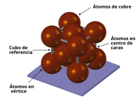
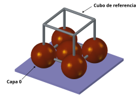
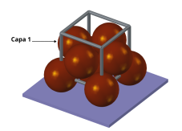
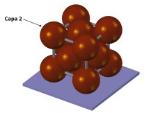
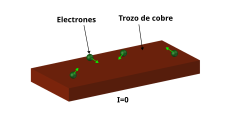
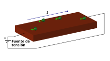

# Materiales conductores

En la naturaleza existen materiales que tienen la capacidad de **conducir la electricidad**. Cuando se someten a la acción de un **campo eléctrico**, los electrones se desplazan por el material. Uno de los elementos más conductores que existen es el **cobre**, que es el que utilizaremos como ejemplo. La mayoría de los cables que utilizamos para conectar nuestros aparatos electrónicos utilizan **cables de coble**

## El átomo de cobre

El **cobre** (Cu) tiene el **número atómico 29**: Es decir, que tiene **29 protones** en el núcleo y 29 electrones orbitando. De todos ellos, 28 están en orbitales estables. Esto significa que son electrones internos que no forman enlaces con otros átomos. Pero queda un **electrón exterior** de baja energía, que tiende a compartirse con otros átomos. A todos los efectos es como si se tratase de un átomo de hidrógeno, que tiene un único electrón que puede compartir con otros átomos

## El cobre como material

El cobre, como metal, está formado por millones de átomos agrupados formando una estructura 3D, que denominamos **estructura cristalina**. Están empaquetados en una estructura de tipo **Cúbica Centrada en las Caras** que es **muy compacta**. De hecho, es la manera más densa de agrupar esferas del mismo tamaño. En este dibujo se muestra la estructura, utilizando un cubo como referencia. En total hay **14 átomos** en este cubo: **8** en los **vértices** y **6** en los centros de las caras

  

Para entender mejor esta estructura lo mejor es abrir el archivo 3D en FreeCAD: [07-Cobre-cristal.FCStd](images/07-Cobre-cristal.FCStd) y juguetear con él

En esta serie de imágenes lo vemos desglosado en capas. Utilizamos un cubo como referencia. En la primera capa se sitúan 5 átomos de cobre: 4 en los vértices y uno en el centro de la cara inferior, que se apoya en el suelo

  

En los huecos dejados por la capa 0, se sitúan 4 átomos. Coinciden con los 4 centros de las caras verticales del cubo de referencia

  

Por último están los átomos de la cara superior, que es igual a la inferior: 4 átomos en los vértices y uno en el centro de la cara superior

  

Cada átomo de cobre **comparte su electrón exterior** con el resto, formándose un **orbital gigante** que recorre todo el material, manteniendo unidos los átomos de cobre. Esto es lo que se conoce como **enlace metálico**

En este orbital del enlace metálico es donde los electrones se están moviendo libremente por todo el material. Y estos son los electrones que reaccionan a los campos eléctricos. Debido a esto, el material **conduce la electricidad**

## Comportamiento eléctrico

Cuando tenemos un material de cobre, como un cable, **sin conectar** a ninguna **fuente de tensión**, los electrones se mueven, pero su **desplazamiento medio es 0**. Es decir, que **no producen ninguna corriente eléctrica media**. La corriente es 0 ($I=0$), aunque hay movimiento de electrones

  

Ahora conectamos una **fuente de tensión** a ambos extremos del fragmento de cobre para generar un **campo eléctrico**. Todos los electrones libres ahora se desplazan hacia el **polo positivo** (lo que genenera una corriente, que por convenio se dibuja en el sentido del polo positivo al negativo, aunque los electrones van en sentido contrario)

  

¡OJO! Los electrones que se mueven NO son los 29 del átomo de cobre, sino sólo 1 de cada átomo, que es el que está en el orbital exterior, de baja energía

