# Materiales aislantes

Los materiales aislantes **NO permiten** la **circulación de los electrones**. Y por tanto, al someterlos a un **campo eléctrico**, no disponen de **electrones libres** que se puedan mover. Todos están **fuertemente ligados a sus núcleos**

Existen muchísimos materiales aislantes, la mayoría, pero nos vamos a centrar en uno en partícular que es el que se utiliza en los chips: El [dióxido de silicio](https://es.wikipedia.org/wiki/%C3%93xido_de_silicio(IV)), también conocido como **sílice**. Es una **red cristalina** formada por átomos de **silicio** y **oxígeno**

## Átomos de oxígeno

El oxígeno es un elemento indispensable en la vida en la tierra, y se encuentra en muchísimos compuestos, incluido el agua  

El átomo de oxígene tiene el **número 8**, es decir, tiene **8 protones** en el núcleo y **8 electrones** orbitando. Típicamente tiene también **8 neutrones**

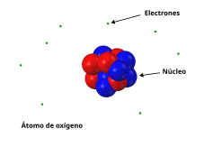  

El oxígeno tiene **2 electrones** sin aparear, y por ello tiende a compartirlos con otros elementos para formar enlaces covalentes

## Molécula de oxígeno

El oxígeno, al igual que le ocurría al hidrógeno, no se encuentra como un átomo aislado, sino que tiende a combinarse con otros átomos, incluso del mismo tipo. En la naturaleza el oxígeno es un gas, que se forma cuando se combina entre sí dos átomos de oxígeno ($O_2$). Esta unión se aproxima como **dos enlaces convalentes** (aunque la realidad es más compleja)

La molécula de oxígeno $O_2$ la representaremos igual que la de $H_2$: Mediante dos esferas (átomos) unidos mediante un cilindro, que en este caso es un enlace covalente doble, pero ese detalle nos es indiferente

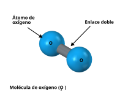  

## Molécula de agua

Como el oxígeno tiene esos 2 electrones para compartir, los puede usar para enlazarse con **dos átomos de hidrógeno**, formando la conocidísima molécula de agua $H_2O$, cuyo estado principal en la naturaleza es el líquido

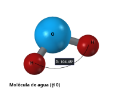  

Los 3 átomos no están alineados, sino que los hidrógenos forman un ángulo de 104.45 grados.  
La [molécula de agua](https://es.wikipedia.org/wiki/Mol%C3%A9cula_de_agua) no la necesitamos para el diseño de chips, pero se incluye aquí para entender mejor el comportamiento del átomo de oxígeno

## Átomo de silicio

El átomo de silicio tiene **número atómico 14**, con **14 protones** y **14 electrones**. En el núcleo tiene típicamente **14 neutros** junto a los protones. De los 14 electrones, hay 4 que están en la capa exterior, que se denominan electrones de valencia. Estos son los **4 electrones** que tienen tendencia a compartirse con otros átomos para formar enlaces covalente

En esta figura se muestra el átomo de Silicio con sus 4 electrones de valencia

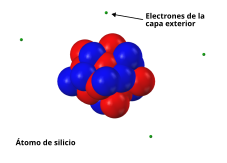  

El silicio es el **elemento fundamental** para la construcción de los chips. Tiende a compartir sus 4 electrones de valencia con otros átomos, por lo que típicamente se enlaza con 4 átomos y los orbitales se distribuyen equitativamente en el espacio formando una **estructura tetraédrica**. Para entenderlo bien vamos a ver una serie de figuras

Primero representamos el **núcleo de silicio** en el centro de un tetraedro regular, que denominamos **tetraedro de referencia**

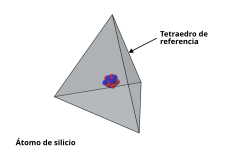  

Ahora dibujamos los **orbitales**. Cada uno apunta hacia uno de los vértices del tetraedro de referencia

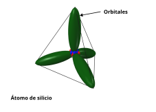  

## Molécula de Silano

La molécula más sencilla que se puede construir con silicio es el [Silano](https://es.wikipedia.org/wiki/Silano) cuya fórmula es $SiH_4$. Es un **atomo de silicio** unido a **4 átomos de hidrógeno**, uno en cada vértice del tetraedro

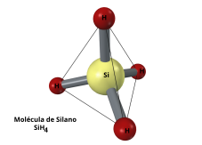  

Esta molécula tiene una estructura 3D, y **no es plana**. Como los átomos de Hidrógeno sólo tienen 1 electrón, no se pueden enlazar con otros elementos, y la molécula es simple. De hecho, el silano es un gas. Veremos cómo en el caso del dióxido de silicio se crea una red cristalina, ya que el silicio se une a otros átomos que a su vez se unen a más silicios

## Óxido de silicio

El [óxido de silicio](https://es.wikipedia.org/wiki/%C3%93xido_de_silicio(IV)), también conocido como **dióxido de silicio** o **sílice** es un compuesto sólido dispuesto en **una red tridimensional**. Se obtiene cuando el átomo de silicio se le unen 4 oxígenes en sus 4 vértices. Y estos oxígenos, a su vez, están unidos a Silicio. Así, cada silicio está unido a 4 oxígenos y cada oxígeno a 2 silicios, formando un cristal 3D, no regular

La estructura básica es **el tetraedro del silicio**, unido a 4 oxígenos

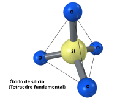  

Estos tetraedros se unen entre sí con diferentes orientaciones formando una red tridimensional sólida. En la figura sólo se muestran 6 átomos de silicio formando un camino cerrado, pero hay más tetraedros conectados por el resto de átomos de oxígeno

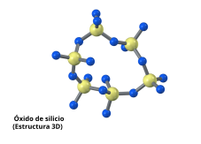  

El óxido de silicio forma un material sólido, con una estructura 3D, que se puede hacer todo lo grande que se quiera 

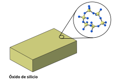  

## Comportamiento eléctrico

En el **óxido de silicio**, TODOS **los electrones** se emplean para la **unión** entre los átomos. Y por tanto, **NO HAY ELECTRONES LIBRES**. No hay una **banda de conducción** donde los electrones pueden moverse libremente cuando están sometidos a un campo eléctrico

Por ello, el dióxido de silicio, a diferencia del cobre, es un **material aislate**. Si se conecta a una **fuente de tensión**, NO aparece una corriente. Es un circuito abierto

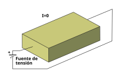  

