# Semiconductores

Hemos visto que en la naturaleza tenemos **materiales conductores**, como por ejemplo el **cobre**, que tienen **electrones libres** con capacidad de moverse por el material, y este movimiento se puede controlar aplicando una tensión. Por otro lado, tenemos los **materiales aislantes**, como **el óxido de silicio**, que NO tienen electrones libres, y que por tanto al aplicar un campo eléctrico no hay electrones que circulen. NO aparece una corriente

También se tiene el término medio. No todos los metales conducen igual. Su resistencia varía. En unos metales hay más electrones libres y por tanto la resistencia es menor, pero en otros la resistencia el mayor

Sin embargo los **semiconductores** son unos **materiales artificiales**, creados por el hombre, y que NO EXISTEN en la naturaleza. Son manufacturados por el hombre. Y **tienen una propiedad increible**: podemos controlar su **conductividad** eléctricamente, mediante la tensión aplicada. El mismo material podemos hacer que se comporte como un **conductor muy bueno**, o como un **aislante casi perfecto**. Simplemente aplicando una tensión. Esto es lo maravilloso de los semiconductores

Vamos a estudiar cómo se construyen estos materiales, y qué propiedades aparecen

## El silicio

La base de los semiconductores es el **silicio**. Vamos a comenzar entendiendo la estructura del silicio como material

Hemos visto cómo el silicio tiene 4 electrones para compartir, con los que forma **enlaces covalentes** con otros átomos. Estos enlaces pueden ser con hidrógenos. En ese caso tenemos una única molécula (silano), que es un gas. También se puede enlazar con 4 oxígenes, y cada oxígeno a su vez está enlazado a 2 silicios, por lo que se genera un material, el **óxido de silicio** con estructura 3D, que es aislante

Los **átomos de silicio** también se pueden enlazar consigo mismo. Cada uno se enlaza con otros **4 silicios**, formando una estructura 3D que es la que conocemos como Sílicio como material. La estrucutra básica es la del **tetraedro**, con un átomo de silicio en el centro y 4 en los vértices

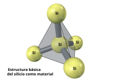  

Para entender el empaquetado del silicio partimos de este tetraedro, que en realidad lo podemos situar en un **cubo unitario** de referencia, donde un silicio está en su centro, y los otros 4 en 4 vértices de este cubo

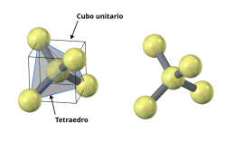  

Este cubo unitario lo rotamos 90 grados y lo desplazamos, uniendo los dos tetraedros

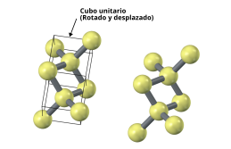  

Hacemos lo mismo con otro cubo unidad

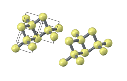  

Y completamos la primera parte con un total de 4 cubos unidad

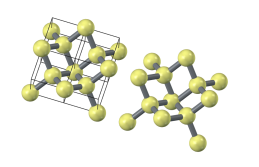  

Y por último obtenemos la estructura final del silicio, que se repite en todas las direcciones del espacio. Recibe el nombre de **estructura cúbica de diamante**

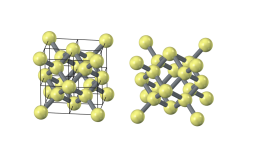  

En esta imagen se muestran los átomos de silicio en referencia al **cubo envoltorio**. Esto nos permite entender mejor la estructura. Hay 8 átomos en los vértices del cubo, y 6 en los centros de las caras. Además hay 8 en el interior. En total hay 22

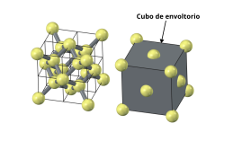  

Vamos a repetir otra vez todo el proceso de generar la red de silicios, pero utilizando un modelo geométrico diferente, donde se han eliminado los enlaces. Ahora las esferas de los átomos de silicio las agrandamos hasta que se tocan entre ellas. Este es el **tetraédrico básico** que forman los grupos 5 Silicios. Uno en el centro y 4 en los vértices del tetraedro

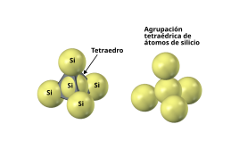  

Esta es la pinta que tiene el mismo tetraedro dentro del **cubo unitario**

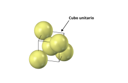  

Ahora los vamos a ir colocando capa a capa. Sabemos que hay 14 átomos sobre el cubo envoltorio (en los vértices y centros de las caras). Los pintamos de amarillo. Luego hay 8 más en la parte interior, que pintaremos de un color naranja. En total hay **5 capas** de átomos, unas sobre otras

* **Capa 1**: Hay 5 átomos sobre la base. Uno en el centro y 4 en los vértices de las esquinas  

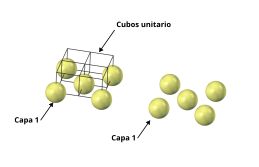  

* **Capa 2**: Hay 4 átomos situados en los centros de los cubos unitarios. Se han dibujado **de otro color** para diferenciar las dos capas

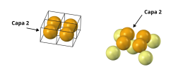  

* **Capa 3**: Hay 4 átomos en los centros de las caras laterales del cubo envoltorio

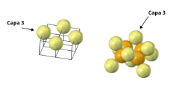  

* **Capa 4**: Es igual a la capa 2: Hay 4 átomos situados en los cubos unitarios superiores

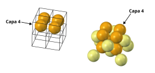  

* **Capa 5**: Es igual a la capa 1, pero en la parte superior. 5 Átomos, 4 en los vértices y 1 en el centro de la cara superior

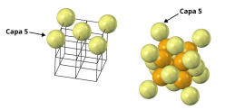  

Así es como quedan los 22 átomos de silicio delimitados por el **cubo envoltorio**

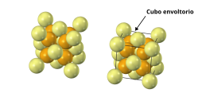  

En esta imagen se muestra una muestra de silicio, formada a partir de 3x3x3 cubos envoltorio

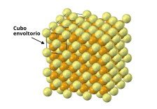  

### Comportamiento eléctrico

El silicio es un **material aislante**. Esto es debido a que todos los átomos están colocados en una red cristalina, y todos los electrones se usan en los enlaces convalentes entre los átomos de silicio, por lo que no queda ninguno libre que pueda moverse libremente en presencia de un campo eléctrico

Si tomamos un trozo de silicio y conectamos dos electrodos de cobre conectados a una fuente de tensión, observamos que **NO HAY CORRIENTE**

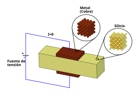  

## Silicio dopado

Partimos de un trozo de **silicio puro**, donde todos sus átomos están perfectamente ordenados en una red cristalina, y NO hay electrones libres. Es un material aislante. Esto ya lo conocemos

Mediante **procesos químicos** es posible sustituir **algunos átomos de silicio** por los de otros elementos, que denominamos **impurezas**. Cuando se agregan estas impurezas decimos que el **silicio está dopado**. La nueva estructura del silicio es como la mostrada en esta figura. 

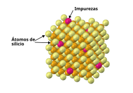  

Es básicamente el mismo silicio, con la misma estructura cristalina, pero hay un porcentaje pequeño de átomos de otro elemento en lugar del silicio. Son los que tienen el color magenta. Los átomos de silicio son los mostrados en los colores amarillentos (se usan 2 colores para  resaltar la estructura 3D)

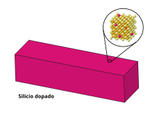  

Las impurezas que típicamente se usan son los átomos de **Boro** y **Fósforo**. Según las impurezas añadidas obtenemos dos tipos de silicio: **Tipo P** y **tipo N**

### Átomo de Boro

El átomo de **boro** (B) es el **número 5**. Tiene 5 protones y 5 electrones, de los cuales 3 están disponibles para generar **3 enlaces covalentes** con otros elementos. Así, tiende a unirse con 3 átomos de silicio, mediante 3 enlaces covalentes. El Boro se usa para generar **silicio tipo P**

En las figuras representaremos al átomo de boro como una esfera "rojiza"

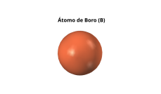  

### Átomo de Fósforo

El átomo de **fósforo** (P) es el **número 15**. Tiene 15 protones y 15 electrones, de los cuales **5 están disponibles** para establecer enlaces covalentes con otros elementos. Se utiliza para generar el **silicio tipo N**

En las figuras representaremos el átomo de fósforo como una esfera "verduzca"

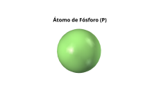  

## Silicio tipo P

Cuando se dopa el silicio con **átomos de Boro** obtenemos el **silicio tipo P**. Inicialmente hay un átomo de silicio que está enlazado a otros 4 átomos de silicio, mediante 4 enlaces covalentes, formando la estructura cristalina que ya conocemos. Mediante el proceso químico de **dopaje** se sustituyen algunos átomos de silicio por otros de Boro

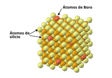  

Este proceso, en apariencia inocuo, tiene una gran repercusión: **cambia las propiedades eléctricas del nuevo material**. El átomo de boro establece enlaces convalentes con 3 átomos de silicio de la red, dejando un átomo de **silicio huérfano**. Este átomo no está suelto. Está enlazado a otros 3 átomos de silicio, dentro de la red. Sin embargo tiene un electrón deseoso de aparearse con otro para formar un enlace covalente. Genera un **hueco** que puede ser ocupado por cualquier otro electrón de los enlaces covalentes cercanos

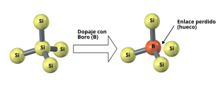  

Un electrón de un enlace covalente vecino puede saltar a este hueco, dejando otro hueco en un lugar diferente: Decimos que **el hueco se ha desplazado**. En esta figura se muestra visualmente este efecto. Se parte de un tetraedro de silicio en una red cristalina, donde hay un átomo de silicio que le falta un enlace. En un momento determinado el electrón del enlace situado a la izquierda "salta" al enlace derecho, provocando que el **hueco** se mueva en sentido contrario: hacia la izquierda

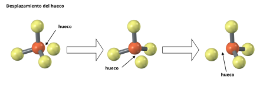  

Y nuevamente salta otro electrón, del enlace izquierdo hacia el central, desplazando el hueco más hacia la izquierda

Volvemos a repetir este concepto de dopaje, pero ahora usando **2 tetraedros** de silicio como meustra de la red cristalina. Al dopar con boro desaparece uno de los enlaces con un silicio

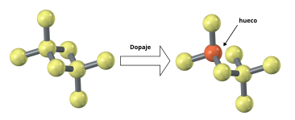  

Y este **hueco** se puede desplazar dentro de la red de silicio

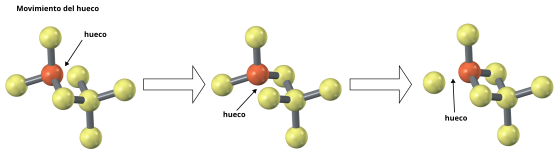  

El resultado es que, debido al dopaje con Boro, aparecen **huecos**, que a todos los efectos se consideran como **cargas positivas** que se mueven. Estas cargas positivas NO se generan debido a que haya más protones que electrones en los átomos. La nueva red dopada es **neutra**: hay la misma cantidad de electrones que protones. Lo que ocurre es que estos enlaces covalentes "se mueven", y son capaces de captar electrones

### Sustrato P

Los chips se fabrican por **capas**, que se van depositando unas sobre otras. La capa inferior, que hace de base para el resto se denomina **sustrato**. Típicamente el sustrato es **Silicio de tipo P**

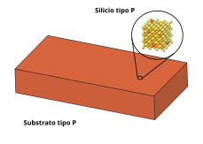  

### Comportamiento eléctrico

Los huecos del silicio tipo P, a todos los efectos, se comportan como partículas de carga positiva, aunque realmente no lo son. En ausencia de campo eléctrico se mueven aleatóriamente, y su desplazamiento medio es 0. Es decir, que aunque hay cargas positivas moviéndose, no hay una corriente efectiva. **La corriente es 0**

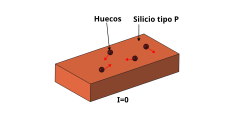  

Cuando se aplica una tensión, los huecos se mueven en el sentido de la corriente, desde el positivo al negativo, generando una corriente

  

La conductividad no es tan buena como en el caso del cobre, donde todos sus átomos aportan electrones libres. En el caso del silicio tipo P por **cada átomo de boro** introducido se **genera un hueco**. Y hay menos átomos de boro que de Silicio, por lo que hay menos portadores de carga y las corrientes son menores (el material tiene mayor resistividad)

Si la polaridad de la fuente de tensión se cambia, la corriente cambia de sentido, como cualquier otro material conductor

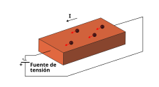  

### Estructura Metal-Óxido-Silicio tipo P

Vamos a analizar una estructura nueva, construida mediante la **unión de capas**. Partimos de un **sustrato de silicio tipo P**. En la parte superior colocamos una capa de **óxido de silicio**, que sabemos que es aislante. Sobre esta ponemos una **capa de metal** conductor (cobre). El sustrato lo conectamos también a una capa de metal, situado en la parte inferior

Ambas capas de metal se conectan a una **fuente de tensión**. Como el óxido es aislante, la corriente que circula en régimen permanente es 0. Como el silicio tipo P es conductor, esta estructura se comporta como **un condensador**, que almacena carga. Los huecos se desplazan hacia el polo negativo, mientras que los electrones se acumulan en la parte superior, antes del óxido. Esta es la parte importante: Esa zona está **repleta de electrones** con capacidad de moverse. Y esta propiedad es la que permite que los **transistores MOSFET** conduzcan cuando están activos, como veremos más adelante

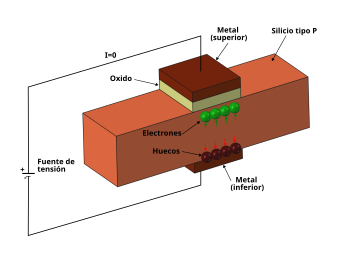  

## Silicio tipo N

Cuando el silicio se dopa con **átomos de Fósforo** (P) obtenemos el **silicio tipo N**. Inicialmente tenemos un átomo de Si que está enlazado a otros 4 átomos también de Si, mediante 4 enlaces covalentes, formando la estructura cristalina que ya conocemos. Mediante el **dopaje** se sustituyen algunos átomos de Si por otros de fósforo (P)

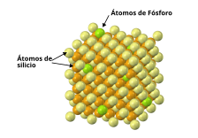  

El nuevo átomo de fósforo tiene 5 electrones libres, para formar enlaces covalentes con el Si, pero sólo puede enlazarse con cuatro de ellos, quedando **un orbital sin enlazar**. Es decir, que queda un **electrón suelto**, que se puede mover libremente

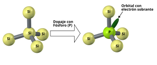  

El silicio tipo N es neutro, pero tiene electrones libres, uno por cada átomo de fósforo. Estos electrones pasan a la banda de conducción, y se pueden mover libremente por todo el silicio, como si fuese un material conductor (aunque con mayor resistividad)

### Capa de silicio tipo N

Dentro de los chips se sitúan capas de silicio tipo N, que representaremos como un trozo de material sólido como el mostrado en esta figura

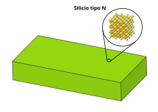  

Se utiliza el color verde para mostrar que es silicio dopado con átomos de fósforo, y que por tanto tiene electrones libres disponibles para conducir la electricidad

### Comportamiento eléctrico

Como el silicio tipo N tiene electrones libres, se pueden mover en presencia de un campo eléctrico. Es decir, que se comportan como un material conductor. En ausencia de este campo, los electrones libres se mueven aleatoriamente, con un desplazamiento medio igual a 0, por lo que no hay corriente efectiva. **La corriente es 0**

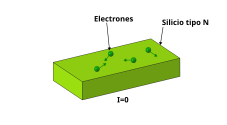  

Cuando se aplica una tensión, los electrones se mueven y aparece una corriente desde el positivo al negativo (aunque los electrones se mueven hacia el positivo), generando una corriente

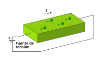  

La conductividad no es tan buena como en el caso del cobre, donde todos los átomos de Cu aportan electrones libre. En el caso del silicio tipo N por cada átomo de fósforo introducido se genera un electrón libre. Y hay menos átomos de fósforo que de Silicio, por lo que hay menos portadores de carga y las corrientes son menores (el material tiene mayor resistividad)

Si la polaridad de la fuente de tensión se cambia, la corriente cambia de sentido, como cualquier otro material conductor

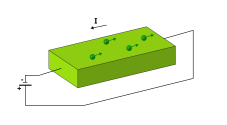  

