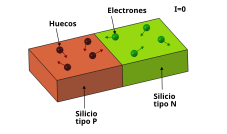
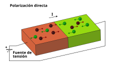
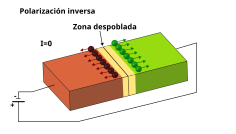
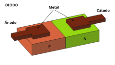
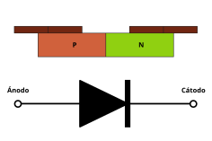

# Unión PN

Hemos visto que los nuevos materiales creados a partir del silicio, **tipo N** y **tipo P**, se comportan como **conductores** de la electricidad, aunque los mecanismos son diferentes. En el caso del tipo P es debido a la presencia de **huecos**, que para nosotros serán como **cargas positivas**. Sin embargo en el caso del tipo N es debido a la presencia de **electrones**. Pero ambos conducen la electricidad

¿Qué ocurre si los **conectamos en serie**? La intuición nos dice que si conectamos dos materiales conductores en serie, también será un material conductor. Los huecos se mueven aleatoriamente por el material tipo P, y los electrones por el tipo N, pero en ausencia de fuente de tensión **la corriente es 0**, como era de esperar

  

## Polarización directa

¿Qué ocurre cuando aplicamos una tensión? Cuando ponemos una tensión positiva al silicio tipo P y una negativa al tipo N decimos que estamos **polarizando** la unión PN en **directa**. Lo que ocurre es que los huecos se mueven hacia el lado negativo, y los electrones hacia el positivo. Los huecos saltan sin problemas desde el tipo P al tipo N, y lo electrones desde el tipo N al tipo P, sin mayor dificultad. Esto genera una corriente eléctrica

  

## Polarización inversa

Si ahora aplicamos **tensión negativa** al silicio tipo P y positiva al tipo N, lo que se conoce como **polarización inversa**, los huecos tienen a moverse hacia el lado negativo, y los electrones hacia el positivo. Y la zona central, la frontera entre ambos materiales, **se queda sin portadores de carga**. Es lo que se conoce como la **zona despoblada**. Y por tanto se convierte en un **material aislante**. Hay un campo eléctrico que lo atraviesa, pero NO hay cargas que lo puedan a travesar 

  

Debido a esto **la corriente** que circula en régimen permanente **es 0**

## El diodo

El **diodo** es el elemento más sencillo que se puede construir con los **semiconductores**. Basta con unir silicio de tipo P con silicion de tipo N, formando una **unión PN**. El comportamiento es el descrito anteriormente: la corriente circula cuando se aplica una **polarización directa**, y no hay corriente cuando la **polarización es inversa**

Esta es la pinta que tiene el diodo dentro de un chip: Basta con añadir los contactos metálicos para conectar los semiconductores con el exterior

  

En esta figura se muestra la sección del diodo junto al símbolo utilizado para representarlo en los esquemas

  

