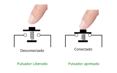
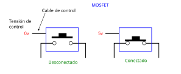
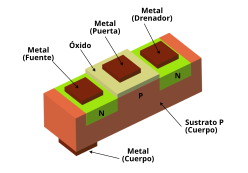
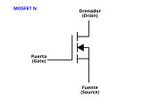
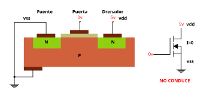
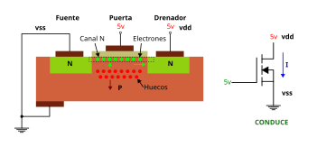
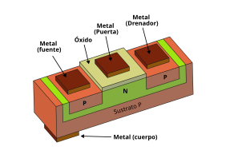
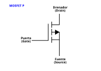
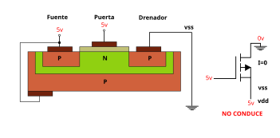
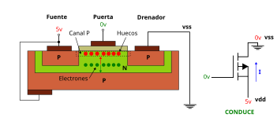

# El transistor MOSFET

El transistor [MOSFET](https://www.zerotoasiccourse.com/terminology/mosfet/) es la base de todos los chips actuales. Es un elemento que se controla mediante **tensión**, y nos permite que la corriente circule o no entre dos puntos. El funcionamiento es exactamente igual que el de un **pulsador mecánico**. Cuando NO está apretado, los dos cables están desconectados eléctricamente uno de otro

  

Vamos a estudiar el MOSFET utilizando esta analogía mecánica de los pulsadores

Para accionar el pulsador se usa **energía mecánica**, proveniente de nuestro dedo. Sin embargo, en los MOSFETs se consigue este mismo efecto pero usando una **tensión** de control externa. Por ejemplo 5v. Si se aplican 5v, el mosfet conduce (es similar al pulsador apretado), pero si se aplican 0v deja de conducir (pulsador liberado)

  

Lo importante es que este comportamiento se consigue usando elementos de **estado sólido**, por lo que **NO hay movimiento de piezas mecánicas**. Esto permite que la conmutación sea muy rápida y consuma poco. Además, los mosfet tienen un tamaño muy pequeño, por lo que se pueden meter millones de ellos en un único chip

Hay dos **tipos de MOSFET**, según los semiconducotres utilizados por su construcción: **Tipo N** y **tipo P**

## MOSFET N

Los mosfet N son los típicos, y más abundantes. Funcionan con **lógica positiva**. Esto es, cuando reciben una tensión positiva (5v ó 3.3v por ejemplo), conducen, y cuando la tensión es 0 NO conducen. La **sección de un mosfet** se muestra en la siguiente figura, donde se pueden apreciar todos sus elementos

  

Se parte de un **sustrato de tipo P** (Silicio tipo P), que recibe el nombre de **cuerpo** (body). Sobre ese cuerpo se añaden **dos zonas de silicio tipo N**, mediante el proceso químico de **difusión**. Sobre la parte superior central del cuerpo se sitúa una capa de **óxido** de silicio y sobre ella una **capa de metal conductor**. Este contacto recibe el nombre de **puerta** (Gate)

Sobre cada uno de los silicios de tipo N se sitúa un contacto metálico. El de la izquierda recibe el nombre de **fuente** y el de la derecha de **drenador**

Por último, se añade un contacto metálico en cualquier parte del cuerpo, que recibe el nombre de **cuerpo**

Así, el mosfet N es un dispositivo que tiene **4 contactos**: Fuente, puerta, drenador y cuerpo. Sin embargo, la fuente y el cuerpo se ponen a la misma tensión (los contactos se usen) por lo que en realidad el mosfet sólo tiene 3 contactos. Se representa mediante el siguiente símbolo:

  

### Funcionamiento

Vamos a comprender el funcionamiento interno del MOSFET N, **como interruptor**. Partimos de un mosfet al que hemos conectado la fuente a 0 voltios (gnd), y el drenador a una tensión de 5v (vdd). Por la puerta introducimos 0v. Sabemos que en esta situación **el mosfet no conduce** y por tanto la corriente que lo atraviesa es 0 (I=0)

  

Por vss entran 0v, que llegan al silicio tipo N. El cuerpo está también a 0v. La unión NP entre la fuente y el cuerpo no conduce ya que ambos están a la misma tensión (0v). No hay desplazamiento medio de las cargas, y por tanto NO hay corriente

La unión PN entre el cuerpo y el drenador tiene polarización inversa, y por tanto NO hay corriente. Es decir, que por el drenador no circula tampoco ninguna corriente. Todo está en calma. Nada conduce. El mosfet está cerrado

Ahora introducimos 5v por la puerta. Aparece un campo eléctrico desde el óxido de silicio hacia la zona P, que hace que los huecos se separen del óxido y vayan hacia el interior. Por el contrario, los electrones se mueven hacia el óxido. Aparece lo que se llama un **canal N** en el que hay electrones libres que se pueden desplazar entre la fuente y el drenador. El mosfet está abierto y conduciendo corriente

  

## MOSFET P

Los mosfet P funcionan con **lógica negativa**. Esto es, cuando reciben una tensión positiva (5v ó 3.3v por ejemplo), NO conducen, y cuando la tensión es 0 sí conducen. La sección de un mosfet se muestra en la siguiente figura, donde se pueden apreciar todos sus elementos

  

Se parte de un sustrato tipo P al que se le añade una zona de difusión de tipo N. Dentro de ella se añaden dos zonas de difusión tipo P. Sobre la zona N se coloca el óxido y sobre esta el contacto metálico de la puerta

Este es el símbolo del MOSFET P:

  

### Funcionamiento

Vamos a comprender el funcionamiento interno del MOSFET P, **como interruptor**. Partimos de un mosfet al que hemos conectado la fuente a 5v voltios (vdd), y el drenador a una tensión de 0v (vss). Por la puerta introducimos 5v. Sabemos que en esta situación el mosfet no conduce y por tanto la corriente que lo atraviesa es 0 (I=0)

  

El cuerpo y la fuente están a 5v, por lo que su unión PN no conduce, al estar a la misma tensión. No hay desplazamiento medio de las cargas y por tanto **NO hay corriente**

La unión NP entre puerta y drenador está polarizada en inversa, por lo que no hay corriente. Por el drenador no circula tampoco ninguna corriente. Todo está en calma. Nada conduce. El mosfet está cerrado

Ahora introducimos 0v por la puerta. Aparece un campo eléctrico desde la zona P hacia el óxido de silicio, que hace que los huecos se acerquen hacia el óxido. Por el contrario, los electrones se mueven hacia la zona p. Aparece lo que se llama un **canal P** en el que hay huecos libres que se pueden desplazar entre la fuente y el drenador. **El mosfet está abierto y conduciendo corriente**

  

🚧 DEBUG 🚧

