# Puerta NOT

Vamos a entender **cómo se implementa una puerta NOT** directamente en Silicio, explicando cada uno de los **niveles de abstracción** implicados

## Nivel de electrónica digital

La **puerta NOT** es uno de los **elementos primitivos** del **nivel de electrónica digital**. A este nivel se representa mediante un símbolo (un triángulo con un círculo y dos rectas que simbolizan la entrada y la salida)

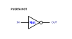  

Esta puerta tiene una entrada y una salida. Se puede encontrar más información en el circuito [ax-not](https://github.com/Obijuan/Icestudio-Digital/wiki/ax%E2%80%90not)

En este nivel nos centramos sólo en la parte digital. No hay corrientes ni tensiones, sólo **bits** que valen **0** ó **1**. Se hace abstracción de la tensión de alimentación, así como de todos los detalles de implementación

## Nivel de transistores

La puerta NOT **se implementa** mediante **2 transistores MOSFET**, uno de tipo N y otro de tipo P. A este nivel además de los pines de datos de la puerta (IN y OUT), tenemos las alimentaciones (VDD, VSS) y los cables de conexión entre los transistores

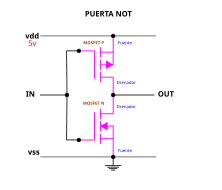  

Cuando entran 0v por **IN**, el MOSFET inferior NO conduce, pero el superior sí, por lo que la tensión que sale por **OUT** es 5v (la inversa de 0v). Por el contrario, si metemos 5v por **IN**, el mosfet inferior SÍ CONDUCE y el superior NO, sacando un valor de 0v por **OUT**

Vamos a verlo gráficamente usando el **modelo mecánico** con pulsadores. En este modelo un bit a 1 se representa con un dedo que ejerce fuerza de presión, y un 0 cuando el dedo no la ejerce

Partimos de esta imagen, donde el dedo NO ejerce presión (0). Hay un mecanismo de balancín que mediante el muelle superior hace que el pulsador **P1** esté **APRETADO**, y que el **P2** esté **LIBERADO**, haciendo que por la salida salga un **1**

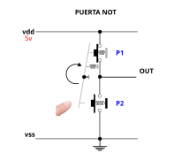

Ahora el dedo ejerce presión (1). El pulsador inferior se aprieta, y por el balancín, el botón superior se libera. Lo que sale por la salida ahora es un 0

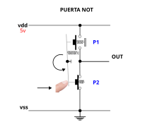  

## Nivel de semiconductores

Así es como queda la puerta NOT implementada en la realidad, construida en un chip a partir de capas de materiales

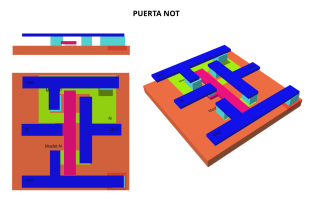  

En este nivel se encuentran todos los detalles: Tipo de material usados, interconexiones entre capas, cableado, disposición física de los mosfet, tamaño...

Para entender esta implementación real de la NOT vamos a ir construyéndola capa a capa, aplicando los conceptos que ya conocemos. En la primera capa se encuentra el **sustrato**, que es silicio tipo P

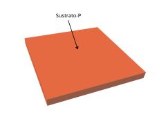  

Sobre este sustrato es donde se sitúan todos los MOSFETs. Lo primero que añadimos es una **zona de contacto** para su posterior conexión a la tensión de referencia **vss** (gnd). Es una **zona p** altamente dopada que facilita la conexión hacia el exterior. En inglés se denomina **p-tap**

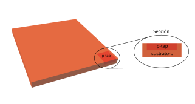  

Estas son las **zonas N**, que contienen **silicio tipo N**. Las dos zonas N más pequeñas conforman un MOSFET N. La zona N grande se utiliza para insertar un MOSFET P

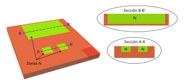  

Dentro de la zona N grande se introducen 2 **zonas P** (Silicio tipo P) para construir el MOSFET P, y una zona para facilitar el conexionado de esta zona con la tensión positiva (vdd), que se denomina **p-tap**. Esta zona es de tipo N altamente dopada

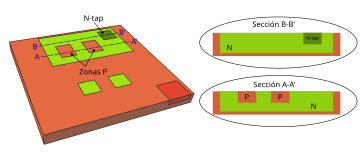  

Con esto se finaliza la **primera capa**, que es la que contiene **los materiales semiconductores**. En ella se encuentran nuestros dos MOSFET, de tipo P y N para la construcción de la puerta NOT

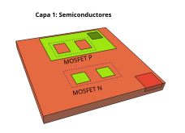  

En la siguiente capa se coloca el **óxido de silicio**, para la construcción de los mosfet. En la figura sólo se muestra el óxido utilizado para los mosfet, pero en realidad está por toda la superficie (salvo por las zonas donde se realizan los contactos)

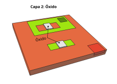  

Sobre la capa de óxido se sitúan una de **polisilicio** para unir las puertas de los mosfet. El polisilicio es aislante, pero se coloca una variante dopada que es muy conductora

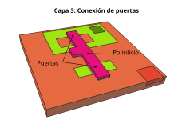  

La última parte son las **conexiones** eléctricas entre todos los elementos. Esto se hace en una nueva capa donde se sitúa el material conductor. Para conectar las capas inferiores con esta capa de metales se utilizan **vías**, que son conductores situados *en vertical*

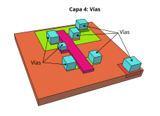  

La **capa superior** es la de los metales conductores, que unen todas las partes y que se conectan con el exterior

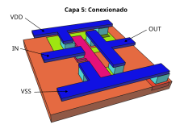  

## La potencia de la abstracción

Una de las herramientas más potentes que tenemos en Ciencia e Ingeniería es **la abstracción**. Gracias a ella conseguimos abordar la **complejidad** de los sistemas reales, que de otra manera sería inviable

Los procesadores actuales contienen **decenas de miles de millones** de transistores, con sus cables de conexión. Es de una complejidad inabordable para cualquier humano

Gracias a la **abstracción** creamos **modelos simplificados** que permiten al diseñador centrarse sólo en los conceptos de interés, ignorando el resto de detalles

Vamos a verlo con el ejemplo de **la puerta NOT**. Tenemos 3 niveles diferentes: **semiconductores**, **transistores** y **Electrónica digital**. 

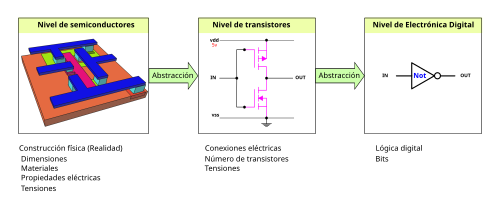  

La puerta NOT "verdadera", la que se construye físicamente en el chip. Está formada por la unión de diferentes materiales: silicio p, silicio n, metal conductor, polisilicio, óxido de silicio... Para su construcción necesitamos detalles como el tamaño de las diferentes zonas, qué hay que colocar en cada capa, etc 

Aplicando la **abstracción** creamos un **símbolo gráfico nuevo** para representar al **transistor**. Pero a este nivel sólo nos interesa su funcionamiento en abstracto, sin todos los detalles. No necesitamos saber nada de silicio tipo p o n. Sólo cómo se comporta a nivel eléctrico. Nos abstraemos de todos los detalles de fabricación

El diseñador electrónico, a este nivel, crea diseños usando este nuevo símbolo, e indicando cómo están unidos entre ellos y cómo se aplican las diferentes tensiones. Estamos al nivel de **transistores**

Esto tiene un efecto muy interesante. Ahora el diseñador puede crear cosas nuevas usando transistores, que en principio seguirán funcionando con **independencia de la tecnología** con la que están implementados. Ahora tenemos chips basados en semiconductores. En el futuro será otra tecnología, pero el funcionamiento del transistor es el mismo, y los diseños basados en él seguirán funcionando

En el siguiente nivel de abstracción entramos en la **electrónica digital**, donde usamos un modelo mucho más implificado para la puerta NOT. Hacemos abstracción incluso de la tensión eléctrica. El diseñador no tiene que saber nada de tensiones ni corrientes, sólo de bits y cómo cambian al atravesar las diferentes puertas lógicas

🚧 DEBUG 🚧
