# Puerta NAND

La **puerta NAND** es muy importante porque a partir de ella **se pueden implementar todas las demás**. Vamos a estudiarla en los tres niveles que ya conocemos

## Nivel de electrónica digital

La puerta NAND tiene 2 entradas y una salida. A nivel lógico es una puerta AND conectada en serie con una puerta NOT

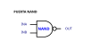  

## Nivel de transistores

La puerta NAND se implementa con **4 transistores**, 2 de tipo P y 2 de tipo N. La idea es que en cada momento hay dos transistores que están en **estados opuestos:** uno conduce y otro no. Los tipo P generan salida a **1**, y los tipo N a **0**. La clave de la puerta NAND son los dos transistores N en serie. Sólo si ambos están activados, se genera un **0** a la salida

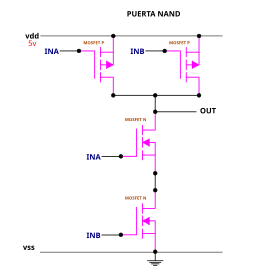  

Para entender el funcionamiento vamos a utilizar el modelo de **pulsadores**, por su simplicidad. Empezamos por el caso de reposo, en el que ambas entradas están a `0`. En este estado ambos transistores P (los superiores) conducen, y generan un `1` por la salida `OUT`. Por el contrario los MOSFETS N están abiertos, y no conducen

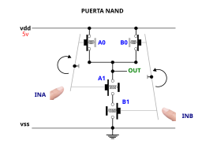  

Si apretamos solo una de las dos varillas (por ejemplo INA), el pulsador `A0` se abre y el `A1` se cierra. Pero esto NO tiene efecto porque `B1` sigue abierto y `B0` cerrado, por lo que en la salida se obtiene un `1`

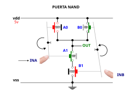  

Si apretamos las dos varillas (INA y INB), los dos pulsadores superiores `A0` y `B0` están desconectados, y los dos inferiores `A1` y `B1` conectados. Por la salida sale un `0`

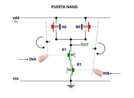  

## Nivel de semiconductores

Esta es la implementación del chip a nivel de semiconductores

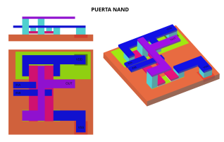  

Vamos a ir viendo el chip capa por capa. En la primera capa está el sustrato de silicio (p) con todos los mosfets (2 de tipo p y 2 de tipo n), así como las zonas altamente dopadas para la conexión a `vdd` y `vss`

En la primera capa se encuentran todos los materiales semiconductores: silicios tipo p y n

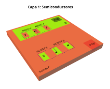  

La siguiente es la capa de **óxido de silicio**. Se encuentra en toda la superficie excepto en las zonas que se conectan hacia el exterior a través de las vías. Sin embargo, sólo se muestra en el dibujo las zonas de óxido que están sobre las puertas de los transistores mosfets

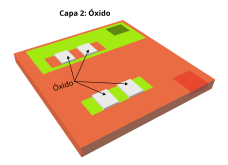  

En la siguiente capa está el **polisilicio** de interconexión entre las 4 puertas de los transistores

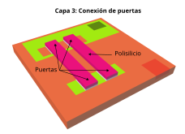  

La capa de las vías contiene elementos conductores para realizar conexiones verticales con las capas de los cables. Hay 2 capas de metales, a diferentes niveles, por lo que las vías son de diferentes alturas: unas para conectar con la capa **metal-1** y otras para la capa **metal-2**

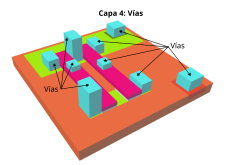  

Las conexiones se realizan en dos capas diferentes. En la primera están las señales `VDD`, `VSS`, `INA` y `INB`

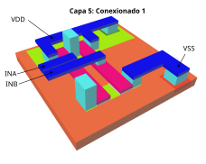  

En la siguiente capa está la señal `OUT`

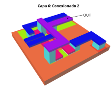  

