# Biestable D

El **Biestable D** es uno de los **elementos primitivos** de la electrónica digital, y el que da lugar a la creación de los **circuitos secuenciales**. Este biestable se presenta en el circuito [ax-sysdff](https://github.com/Obijuan/Icestudio-Digital/wiki/ax%E2%80%90sysdff) del proyecto [Icestudio-Digital](https://github.com/Obijuan/Icestudio-Digital/wiki)  

A pesar de ser un elemento primitivo a nivel de electrónica digital, hay muchos conceptos e ideas involucrados en su creación. En esta sección veremos **cómo se crea desde 0**, a partir de materiales semiconductores

## Nivel de electrónica digital 

El Biestable D es el elemento que **almacena un bit** durante un ciclo. Transcurrido este ciclo se almacena el siguiente valor que llegue

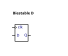  

Aunque es el elemento mínimo de memoria a nivel de electrónica digital, se necesitamos muchos elementos de los niveles inferiores para su implementación. Vamos verlos poco a poco

## Oscilador: Almacenamiento de un bit

La manera de almacenar un bit en silicio es mediante **2 inversores conectados en anillos**, es decir, formando **un oscilador**. Esta es la pinta que tiene:

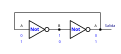  

Este circuito puede estar en **dos estados estables** diferentes. Imaginemos que en el punto A tenemos el bit 0. Entonces en el punto B tendremos 1, que se convierte de nuevo en 0 y se realimenta de nuevo al primer inversor. A la salida se tiene el valor **0 estable**

Pero también es estable lo contrario: Si en A tenemos 1, en B tenemos 0 y por la salida sale un 1 estable. Es decir, que es un circuito que puede tener 2 valores estables diferentes: 0 ó 1

¿Cómo introducimos un valor inicial en este anillo?. Conceptualmente lo vemos introduciendo **un interruptor de 2 posiciones**. Cuando se pone en la **posición 1** se introduce el valor externo `D`, que sale por la salida. 

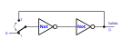  

Si ahora cambiamos a la **posición 2**, se conecta la realimentación y este bit queda "atrapado" en el anillo, dando vueltas. Cualquier nuevo valor que haya por la entrada NO se mete en el anillo, hasta que se vuelva a cambiar el interruptor

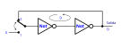  

Con la tecnología CMOS la manera de implementar un switch que permita conectar un cable con alguno de otros dos es mediante **2 pulsadores complementarios**. El esquema anterior queda así:

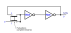  

Los **pulsadores complementarios** funcionan a la vez, y siempre en estados contrarios: mientras uno conecta, el otro está abierto, y vice versa. Estos pulsadores se implementan muy fácilmente con tecnología CMOS, como veremos en el siguiente apartado

En la implementación real las señales se ingresan entre los dos inversores, por lo que hay que añadir un tercer inversor en la señal de la entrada. Esta configuración permite que la señal de entrada pase por un buffer, y también permite una mejor conexión en cascada entre varios osciladores

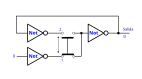  

## Puerta de transmisión (TG)

La puerta de transmisión es un elemento que funciona como **un pulsador**, conectando eléctricamente dos cables independientes. Ya habíamos visto cómo un MOSFET funciona también como un pulsador, que sólo permite circular la corriente en una dirección. **La puerta de transmisión** permite hacerlo en **ambas direcciones**, por eso funciona exactamente igual que un pulsador

Este componente tiene 3 entradas: Los dos cables `A` y `B` que se conectan, y la señal `ENA` que permite activar/desactivar la conexión

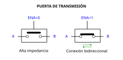  

Cuando `ENA=0` el interruptor está en abierto, es decir, en **alta impedancia**. Cuando `ENA=1` el pulsador está apretado, y la corriente puede circular en ambos sentidos (dependiendo de la tensión aplicada)

La implementación de esta puerta se realiza colocando **dos MOSFETS**, uno P y otro N, **en paralelo**, pero conectando las fuentes con los drenadores

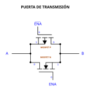  

Este es el símbolo utilizado para representar a la puerta de transmisión. Tiene 4 entradas. De ellas 3 son independientes: `A`, `B` y `ENA`. Pero hay una cuarta, que es $\overline{\text{ENA}}$. Es la complementaria a `ENA`. Es decir, que hay que añadir un inversor de manera externa para generar la señal complementaria. Esta puerta NOT NO se incluye dentro de la puerta de transmisión para ahorrar recursos y que varias de estas puertas compartan la misma NOT

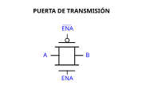  

## Latch

El **latch** es un componente que **recuerda un bit**. Tiene dos entradas: una de datos (`D`) y otra de habilitación (`ENA`). Cuando `ENA` es 0, el latch está cerrado, y la entrada no afecta a la salida. Sale el valor almacenado. Cuando `ENA` es 1, el latch está en **modo transparente** y todo lo que entra por `D` sale por `Q`. Cuando se deshabilita, queda almacenado el último valor que había por su salida

El latch **se implementa** a partir del oscilador que hemos visto en el apartado anterior, utilizando la señal `ENA` para controlar los dos pulsadores complementarios. Este es el esquema lógico:

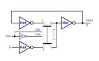  

Los pulsadores complementarios se implementan mediante dos **puertas de transmisión** complementarias. Este es el esquema final del latch:

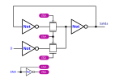  

Y estos son los dos circuitos equivalentes con los diferentes valores de la señal `ENA`

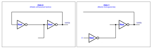  

Esta implementación nos sirve para contar el número total de transistores que necesitamos. Cada inversor usa 2 mosfet. Cada puerta de transmisión otros dos. En total hay 2 puertas de transmisión (4 transistores) y 4 inversores (8 transistores). En **total** se necesitan **12 MOSFETS**

El latch lo representamos como un bloque con las entradas correspondientes

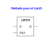  

Esta es su **tabla de verdad**, donde **D** es la entrada, **Q** su estado actual (Salida) y las variables booleanas `d` y `q` que indican respectivamente el valor de la entrada y del estado actual (que puede ser 0 ó 1). El valor `x` significa **NO IMPORTA**. Da igual qué valor tenga

| Ena | D | Q | Descripción |
|-----|---|---|-------------|
|  0  | x | q | Modo almacenamiento. El biestable almacena el valor q |
|  1  | d | d | Modo transparente. La salida es la misma que la entrada |

El Latch lo podemos representar como una **Barrera** que deja pasar o no los bits. La señal **ENA** significa **Barrera quitada**. Cuando `ena=0`, la barrera NO está quitada, es decir, que estamos en modo almacenamiento. Cuanod `ena=1`, la barrera está quitada, y estamos en modo transparente

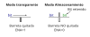

## Implementación del biestable D

El biestable D captura el dato de entrada **en flanco de subida**. Este comportamiento se logra **conectando en cascada** dos Latches, denominados **maestro** y **esclavo**

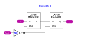  

Mediante este mecanismos, el biestable D sólo captura un valor en un instante muy estrecho. Y esta es la clave de los sistemas síncronos

Para la implementación de un biestable D se necesitan un total de **26 MOSFETS**. 12 por cada Latch (24), y 2 más por el inversor (26). De todos ellos, la mitad son MOSFET-N y la otra mitad MOSFET-P

Vamos a estudiar este mecanismo más en detalle. Este es el **cronograma** que vamos a estudiar. Tenemos un Biestable D que inicialmente tiene almacenado el valor 0 (`Q=0)

  🚧 TODO 🚧
