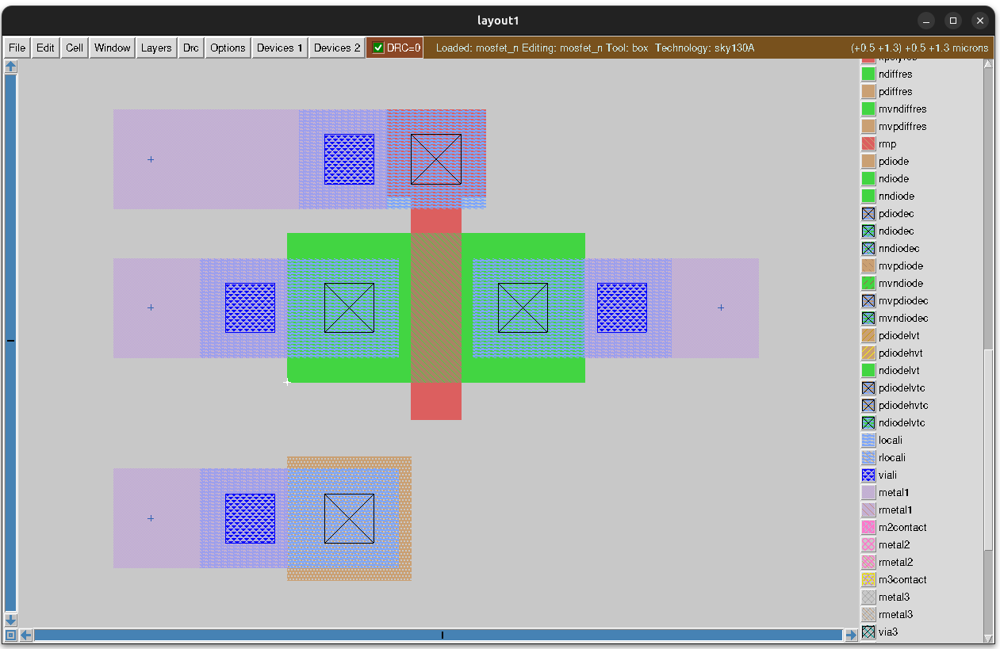
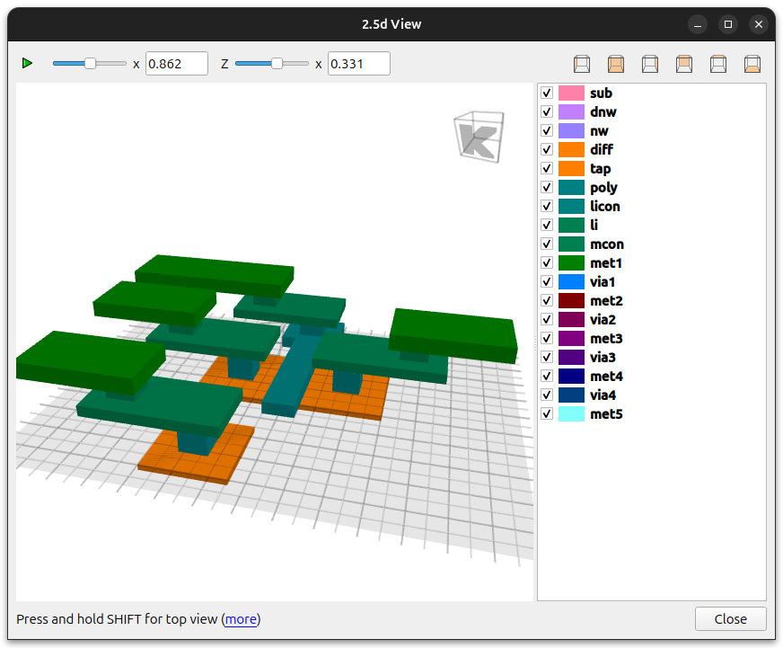
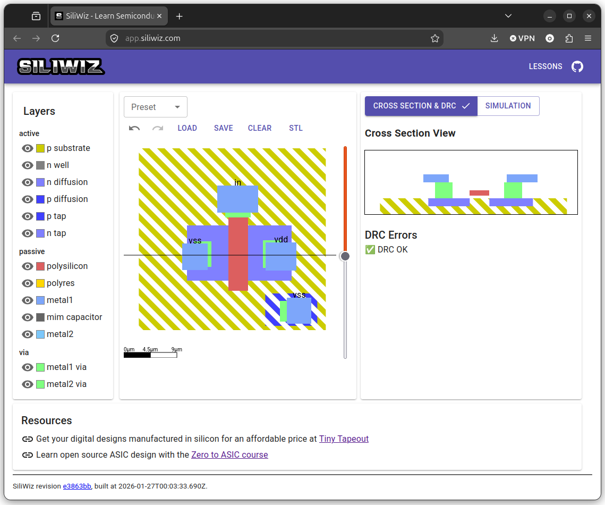
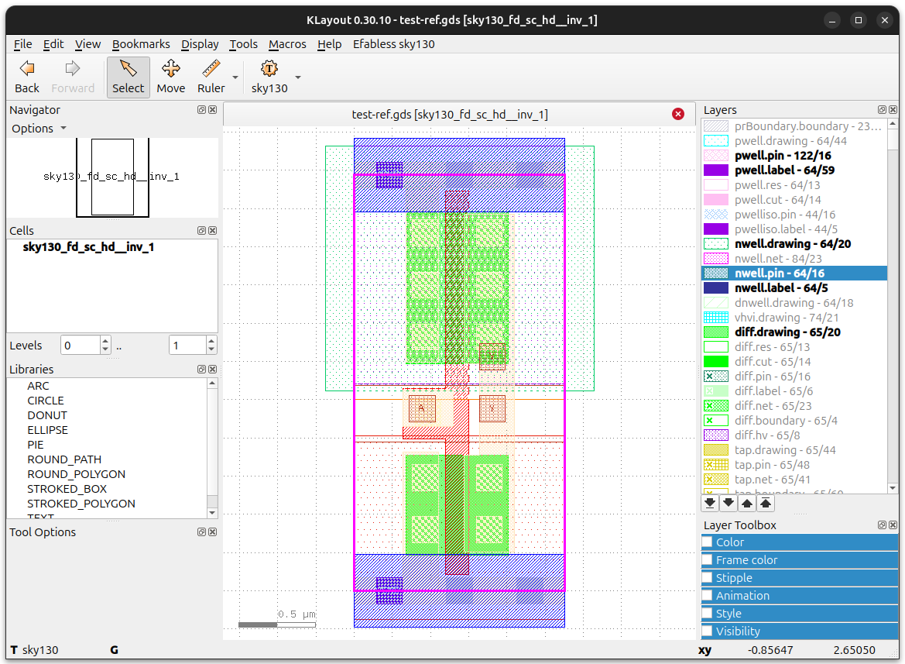
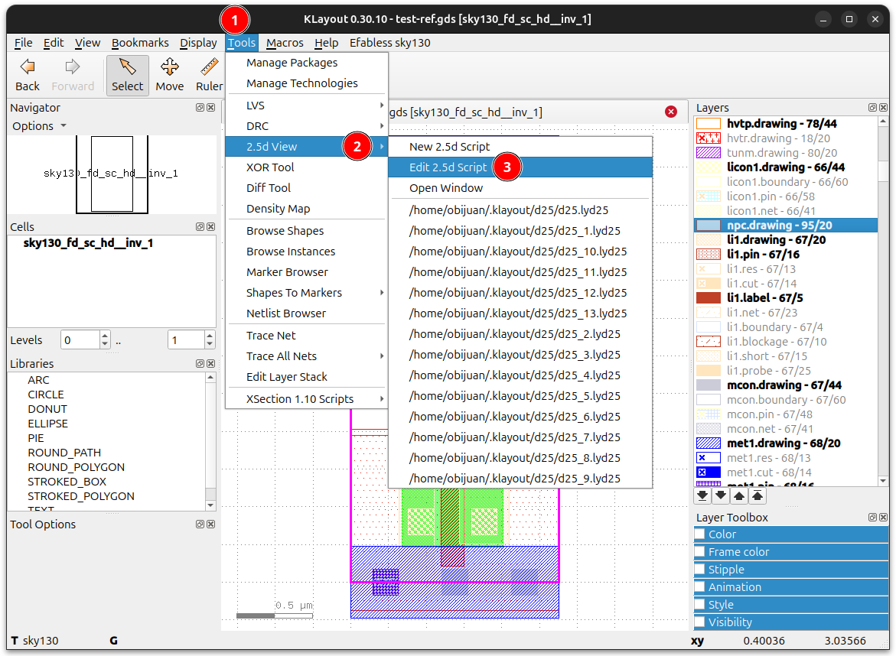
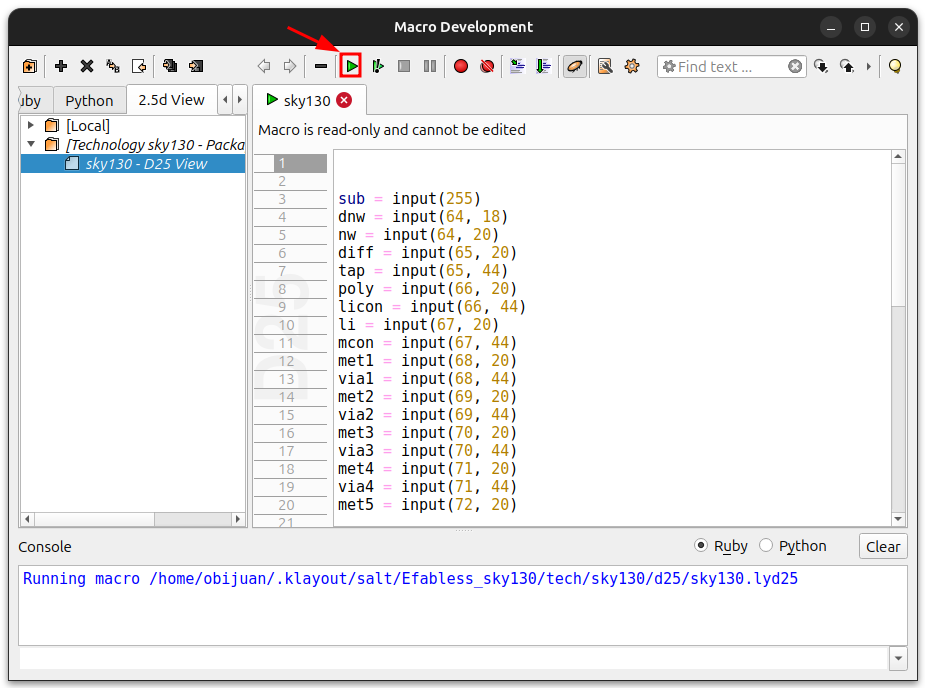
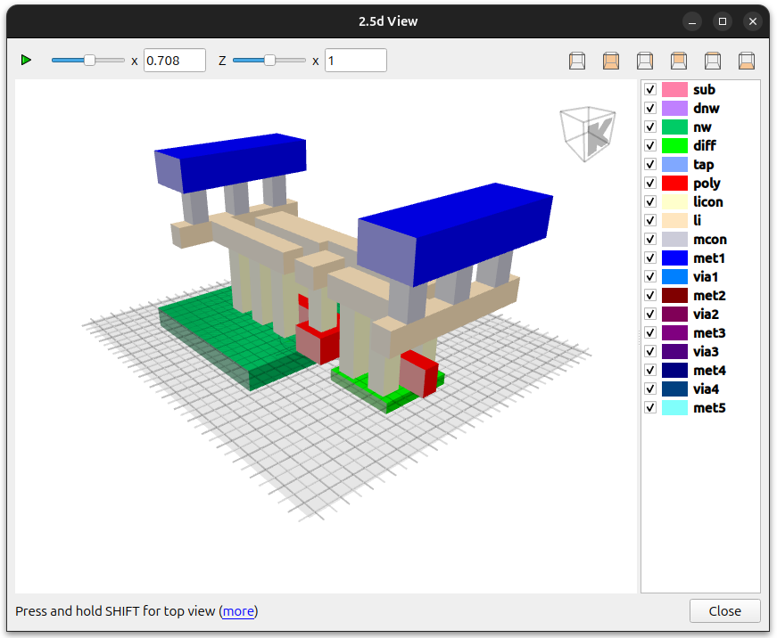
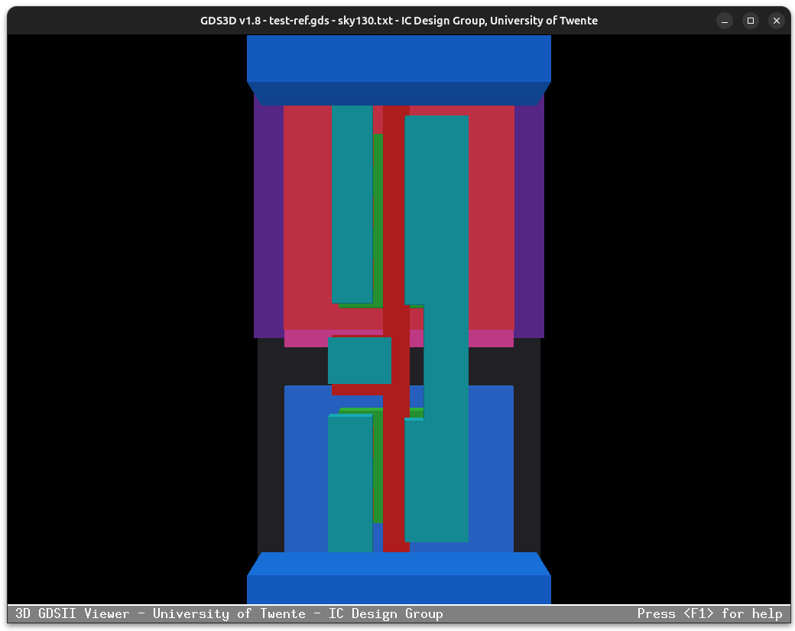
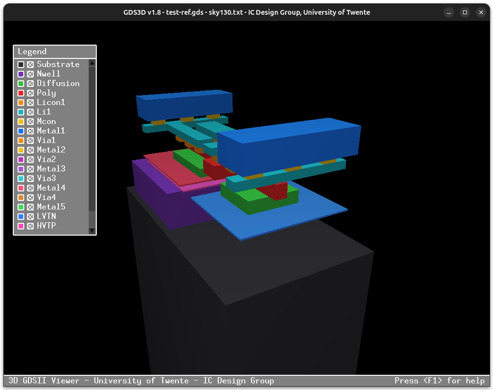
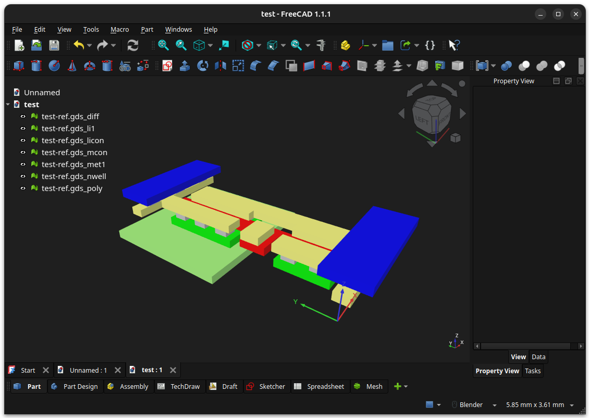

# Diseño de Chips

Hemos visto cómo los chips se construyen a partir de **capas**, unas encima de otras. En cada capa hay unas **zonas**, que tienen un **tamaño** determinado. En las capa de los conductores se realizan las **interconexiones** entre todos los elementos. El **ingeniero diseñador** de los chips es la persona que define la **posición** de todas las zonas, sus **tamaños**, y las **interconexiones**, de manera que el chip tenga la funcionalidad requerida

¿Qué **tamaños mínimos** podemos usar para las zonas? ¿Cuántos niveles de interconexiones se pueden usar? ¿Qué distancias mínimas tiene que haber entre los diferentes elementos?. Todos los parámetros mínimos que necesita el diseñador para construir el chips están determinados por la **tecnología de fabricación**, que la proporciona el **fabricante**. Con unos fabricantes se pueden construir chips con transistores más grandes, mientras que con otros más pequeños (y por tanto caben más)

## PDK (Process Design Kit)

Es el fabricante el que proporciona todas las **reglas de diseño**, tamaños, archivos y modelos necesarios para que un **diseñador** pueda **fabricar** su chip. Es lo que se conoce con el nombre de [PDK](https://en.wikipedia.org/wiki/Process_design_kit) (Process Design Kit), que se puede traducir como Paquete de diseño de proceso

Puedes encontrar más información (en inglés) sobre el [concepto de PDK](https://www.zerotoasiccourse.com/terminology/pdk/) en la web del curso [Zero to Asic](https://www.zerotoasiccourse.com/) de Matthew Venn

Por tanto, para fabricar un chip, lo primero es tener acceso al **PDK del fabricante**. Y aquí es donde **surge el problema**. El fabricante considera esta información como **confidencial** y hace firmar un **acuerdo de confidencialidad** con los usuarios. Además, el PDK incluye librerías softare con licencias privativas. Por ello **no es posible compartir los diseños** ni distribuir la información...

...¡Hasta que nacieron los **PDKs libres!**


### Skywater 130nm

Las **tecnologías de fabricación** de chips reciben diferentes nombres, para diferenciarlas y poder ver cómo evolucionan. En los años 2000 exístía la [tecnología de 130nm](https://en.wikipedia.org/wiki/130_nm_process) usada por empresas como IBM, Intel, Texas Instrument...  

En el 2020 surgió la **iniciativa SkyWater 130nm**, fomentada por Google, el fabricante de chips [Skywater Techonology](https://www.skywatertechnology.com/) y el fabricante efabless (que ha sido comprado por [Chipfoundry](https://chipfoundry.io/efabless) en el 2026). Liberaron el **PDK de 130nm**, con el nombre de **sky130**. Se trata del **primer PDK Industrial Libre** de la historia. Un hito histórico

Gracias a esto, estudiantes, investigadores, ingenieros y cualquier persona interesada **tenemos acceso a la tecnología de creación de chips**, y podemos **diseñar nuestros propios chips!!** Y lo más importante, podemos **compartirlos** con la comunidad para que otros aprendan y construyan chips más avanzados a partir de este conocimiento

Toda la información del **PDK sky130** está disponible en estos enlaces:
* [Documentación](https://skywater-pdk.readthedocs.io/en/main/)
* [Repositorio en Github](https://github.com/google/skywater-pdk)

En esta figura se resumen los **parámetros** más importantes de **Sky130**, así como los diferentes **niveles** de capas y las **vías** de interconexión entre capas

  


## Diseño a Bajo nivel

¿Cómo se diseña al más bajo nivel? Es decir, ¿cómo se diseñan los chips de la forma más cercana a la realidad? La labor del diseñador es **definir los transistores**, dimensionando y posicionando sus diferentes zonas, y realizar la **interconexión** de todos ellos. Esta parte del diseño, que típicamente se hace **gráficamente** se denomina **el Layout**. Lo podríamos traducir como el **plano del trazado**

Este es un ejemplo del layout de un **mosfet N**, diseñado con **Magic**

  

El **layout** se encuentra en uno o más archivos. El diseñador los crea utilizando **herramientas EDA** para chips. Una de las más antiguas y conocidas es [Magic VLSI](https://opencircuitdesign.com/magic/). Antiguamente este proceso se creaba mediante **dibujos físicos**. El diseñador lo dibujaba en papel

A partir del **Layout** se obtiene el **Fichero de fabricación** que típicamente está en el formato [GDS](https://en.wikipedia.org/wiki/GDSII). Este fichero contiene **toda la información necesaria** para construir **todas** las capas del chips. Es el archivo que lee la máquina de construcción de chips

Además, el Layout lo podemos **simular** para comprobar que funciona adecuadamente, antes de su fabricación, y también lo podemos **renderizar en 3D** para ver la estructura interna del chip

Este es un pantallazo del renderizado 3D del fichero GDS generado a partir del layout del MOSFET N anterior. Se ha renderizado con la herramienta **KLayout**

  

El Layout se diseña con diferentes herramientas. Nosotros vamos a usar 2 diferentes, para tener intuición sobre cómo es el proceso

### Layout en Siliwiz


[Siliwiz](https://app.siliwiz.com/) es un programa que corre on-line para aprender los fundamentos del diseño de chips, desarrollado por [Matt Venn](https://zerotoasiccourse.com/matt_venn/) para su curso [Zero to asic](https://zerotoasiccourse.com/)



Si tienes curiosidad por cómo se hacen los Layouts de manera genérica, sin aplicar a una tecnología específica para que sea más sencillo, puedes seguir este **tutorial**

* [Tutorial de Siliwz: Construyendo un Mosfet N desde cero](https://obijuan.github.io/Tutorial-Siliwiz/)


### Layout en Magic

[Magic](https://github.com/RTimothyEdwards/magic) es un programa **Libre** para **diseñar y fabricar circuitos integrados** utilizando diferentes tecnologías

  

Si quieres aprender a utilizar un programa que sirve para **fabricar** chips reales, usando la **tecnología Sky130nm**, puedes seguir este tutorial:

* [Tutorial de Magic: Construcción de un Mosfet N desde cero](https://obijuan.github.io/Tutorial-Magic/)  


## Visualización en 3D del Layout

El **layout** se diseña en 2D, mediante rectángulos vistos desde arriva que identifican las diferentes zonas. Estos rectángulos están en **capas** a diferentes alturas, como ya sabemos

Para evaluar un fichero GDS, y tener intuición sobre cómo es por dentro un chip, así como ver su "cableado", es muy interesante realizar un **renderizado 3D** del fichero GDS

En esta sección resumimos las diferentes alternativas para renderizar en 3D los **ficheros GDS**, y proponemos una de ella, **el renderizado online**, para utilizar en nuestras pruebas y durante proceso de aprendizaje

### Fichero GDS de pruebas

Para **probar el funcionamiento** de los renderizadores podemos utilizar **cualquier fichero gds**. Pero como todavía no lo sabemos generar, vamos a utilizar un **gds de referencia** muy simple. Se corresponde con una **puerta not**

* [test-ref.gds](examples/test-ref.gds)

### Klayout

El programa Klayout nos permite visualizar un fichero GDS en 2D y 3D. Es el que hemos utilizado en el **tutorial de Magic** anterior. Puedes encontrar más información sobre cómo instalarlo y cómo configuarlo en esta sección: [Tutorial de Magic: Klayout](https://obijuan.github.io/Tutorial-Magic/08-klayout.html)

Abrimos el fichero `test-ref.gds` pinchando en la opción **File/Open**. Se nos renderiza el fichero GDS en **2D** en la parte central



En el panel de la derecha podemos ver TODAS las capas que aparecen. En el renderizado sólo se dibujan las capas resaltadas en negrita

Para obtener el **renderizado 3D** pinchamos en **Tools/2.5d View/Edit 2.5 Script**



En la nueva ventana que aparece pulsamos en el icono **Run current Script**



Nos aparece el **renderizado 3D**, que podemos mover con el ratón




### GDS3D

[GDS3D](https://github.com/trilomix/GDS3D) es un programa libre para el renderizado 3D de ficheros en formato GDS. El ejecutable para Linux se puede bajar directamente de [sourceforge](https://sourceforge.net/projects/gds3d/), y así no hay que compilarlo manualmente. Para instalarlo basta con copiar el ejecutable `GDS3D` a un directorio accesible desde el `PATH`

Para realizar el renderizado se necesita un archivo adicional, de texto, que indique las capas a renderizar y sus propiedades: colores, alturas, etc...

Este es un ejemplo de ese fichero: [sky130.txt](examples/sky130.txt)  

Vamos a renderizar nuestro fichero de referencia. Copiamos los ficheros `test-ref.gds` y `sky130.txt` en el mismo directorio, y ejecutamos `GDS3D -p sky130.txt -i test-ref.gds`

```bash
obijuan@JANEL:~/Develop/Learn-open-silicon/src/examples$ ls
sky130.txt  test-ref.gds
obijuan@JANEL:~/Develop/Learn-open-silicon/src/examples$ GDS3D -p sky130.txt -i test-ref.gds
==============================================================================
GDS3D v1.8, Copyright (C) 2013 IC-Design Group, University of Twente
Created by Jasper Velner and Michiel Soer, http://icd.el.utwente.nl
Based on the gds2pov project by Roger Light, http://atchoo.org/gds2pov/
Copyright (C) 2004-2008 by Roger Light
This program comes with ABSOLUTELY NO WARRANTY. You may distribute it freely
as described in the readme.txt distributed with this file.
==============================================================================

Opened process file "sky130.txt"
Warning: Shortkey is larger than 9, ignoring.

Opening GDS file "test-ref.gds"..
[...]
```

Se nos abre esta ventana. Vemos la **vista superior** del diseño



Con el ratón cambiamos el punto vista, aunque no es intuitivo. También se puede cambiar con las flechas de los cursores. Pulsando la tecla `L` se muestra una ventana con las capas del diseño. Pinchando sobre cada una de ellas las podemos visualizar/ocultar




### Conversión a STL: gdsiistl

Otra manera de realizar la visualización 3D es **manualmente**, exportando primero el fichero **GDS** al formato **STL**. Esto se puede hacer con el script python [gdsiiistl](https://github.com/mbalestrini/gdsiistl)


Para instalarlo hay que crear un entorno virtual de python con las dependencias. En un directorio colocamos el script `gdsiistl.py` y el fichero `test-ref.gds`

```bash
(test) obijuan@JANEL:~/Develop/Learn-open-silicon/src/examples/gdsiistl$ ls
gdsiistl.py  test-ref.gds
(test) obijuan@JANEL:~/Develop/Learn-open-silicon/src/examples/gdsiistl$ 
```

Desde ese directorio se ejecuta el comando `python3 gdsiistl.py test-ref.gds`, y se generan los ficheros **STL**, uno por cada capa

```bash
(test) obijuan@JANEL:~/Develop/Learn-open-silicon/src/examples/gdsiistl$ python3 gdsiistl.py test-ref.gds 
Reading GDSII file test-ref.gds...
Extracting polygons...
Triangulating polygons...
Extruding polygons and writing to files...
    ((np.int64(68), np.int64(20)), met1) to test-ref.gds_met1.stl
    ((np.int64(64), np.int64(20)), nwell) to test-ref.gds_nwell.stl
    ((np.int64(67), np.int64(44)), mcon) to test-ref.gds_mcon.stl
    ((np.int64(65), np.int64(20)), diff) to test-ref.gds_diff.stl
    ((np.int64(66), np.int64(44)), licon) to test-ref.gds_licon.stl
    ((np.int64(66), np.int64(20)), poly) to test-ref.gds_poly.stl
    ((np.int64(67), np.int64(20)), li1) to test-ref.gds_li1.stl
Done.
(test) obijuan@JANEL:~/Develop/Learn-open-silicon/src/examples/gdsiistl$
```

Estos ficheros STL hay que importarlos en una aplicación capaz de leerlos, como por ejemplo Blender o Freecad

Este fichero ha sido generado con Freecad: [test.FCStd](examples/gdsiistl/test.FCStd). Se han importado todos los STLs, se han cambiao de colores y se han movido para que unos estén encima de otros



### Visualización online (Recomendado)

🚧 TODO 🚧
* 


## Celda estándar

Ya hemos visto cómo se crea un MOSFET N con la tecnología sky130. También sabemos cómo a partir de estos mosfets podemos crear otros elementos como inversores, puertas NAND, biestables D...

El fabricante es el que **construye** una **biblioteca** de componentes asociadas a una tecnología, facilitando la vida al diseñador. Cada uno de estos componentes es lo que se llama una [celda estándar](https://www.zerotoasiccourse.com/terminology/standardcell/)

Las celdas están diseñadas no sólo para tener una funcionalidad concreta (una puerta NOT, AND, etc...), sino que tiene unas **dimensiones estandarizadas** y se definen unas **posiciones** concretas para las entradas de alimentación y los pines de la celda. El objetivo es que se puedan crear diseños más complejos simplemente mediante la **unión** de estas celdas

Típicamente la **altura** de las celdas está fijada, pero no su anchura. De esta forma se van **colocando en horizontal**, uniendo todas sus alimentaciones mediante unos **railes horizontales** (que son conexiones en la capa del metal)

Además se colocan otros **railes verticales**, en otra capa metálica, para unir los railes horizontales

🚧 TODO 🚧


🚧 TODO 🚧
* https://github.com/google/skywater-pdk-libs-sky130_fd_sc_hd
* 

